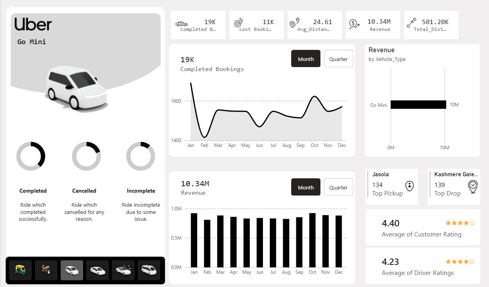
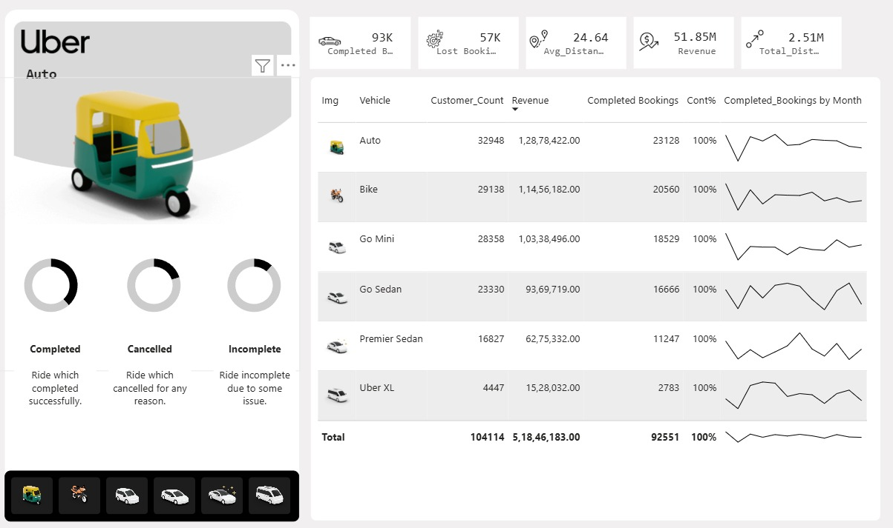
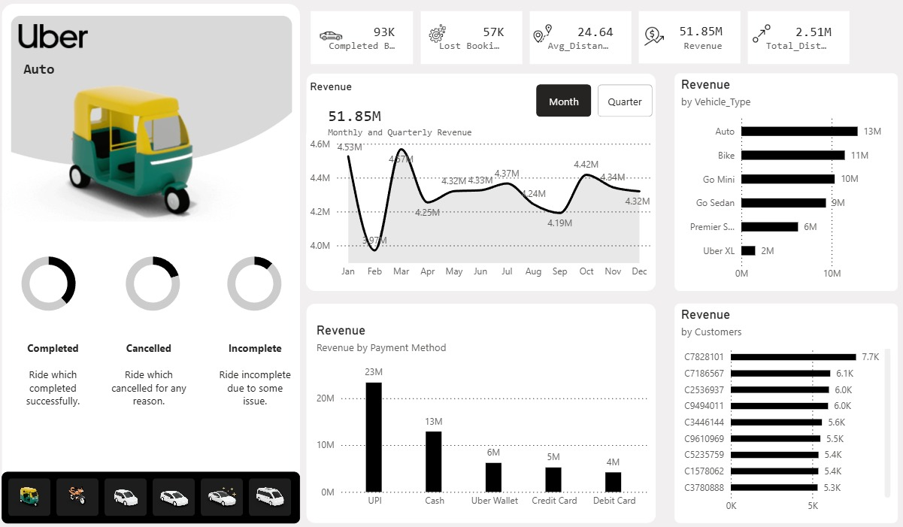
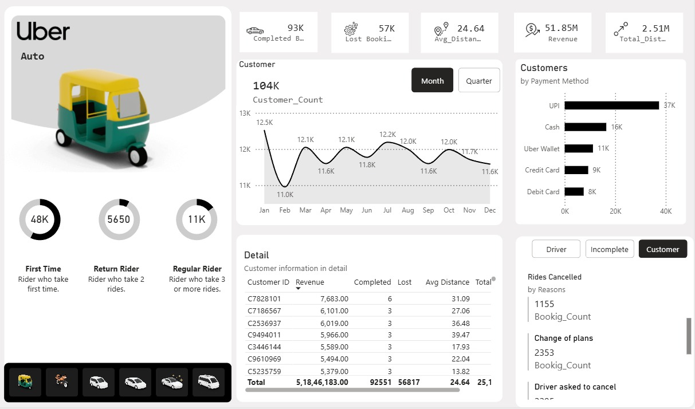
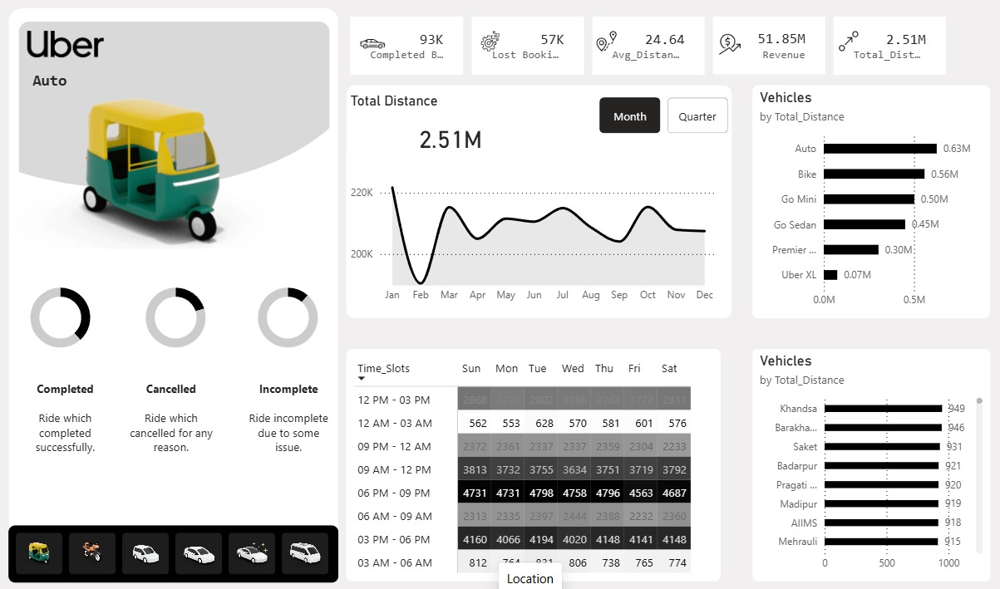

# Uber-Data-Analysis

## 📌 Project Overview
This project is an interactive **Power BI dashboard** developed to analyze Uber ride data. The dashboard provides insights into ride performance, revenue generation, vehicle utilization, rider behavior, and geographical distribution using interactive visualizations.

The objective is to transform raw Uber trip data into meaningful business insights that support data-driven decision-making.

## 🎯 Objectives

- Analyze Uber ride trends
- Monitor revenue performance
- Evaluate vehicle utilization
- Understand rider behavior
- Identify high-demand locations
- Improve operational decision-making through data visualization

## 📊 Dashboard Pages

### 🏠 Home
- Dashboard navigation
- Interactive menu
- Project branding
- Quick access to all report pages

### 📈 Overview
Provides a high-level summary of Uber operations including:
- Total Trips
- Total Revenue
- Average Fare
- Total Distance
- Ride Trends
- Time Slot Analysis
- Key Performance Indicators (KPIs)

### 🚗 Vehicle Analysis
Analyze vehicle performance including:
- Trips by Vehicle Type
- Revenue by Vehicle
- Distance Covered
- Vehicle Utilization
- Ride Distribution

### 💰 Revenue Analysis
Financial insights including:
- Total Revenue
- Revenue Trends
- Revenue by Vehicle
- Revenue by Time
- Revenue Distribution
- Peak Revenue Periods

### 👥 Rider Analysis
Customer insights including:
- Total Riders
- Ride Frequency
- Preferred Ride Time
- Ride Patterns
- Customer Distribution

### 📍 Location Analysis
Geographical insights including:
- Pickup Locations
- Drop-off Locations
- Popular Routes
- High Demand Areas
- Trip Density
- Regional Performance

## 📊 Key Features
- Interactive Dashboard
- Dynamic Filters
- Drill-through Reports
- KPI Cards
- Time Intelligence
- Custom Icons
- Responsive Navigation
- Business-Oriented Visualizations

## 📈 KPIs Included
- Total Trips
- Total Revenue
- Average Fare
- Average Distance
- Revenue Growth
- Ride Count
- Vehicle Performance
- Peak Ride Hours
- Rider Statistics

## 🚀 Skills Demonstrated
- Data Cleaning
- Data Transformation
- Data Modeling
- DAX Calculations
- Power Query
- Dashboard Design
- Business Intelligence
- KPI Development
- Interactive Reporting

## 📷 Dashboard Preview
> Add screenshots of each dashboard page here.
Example:
- Home Dashboard
- Overview Dashboard
- Vehicle Dashboard
- Revenue Dashboard
- Rider Dashboard
- Location Dashboard

## 🎯 Business Value
This dashboard enables stakeholders to:
- Monitor Uber business performance
- Identify peak demand periods
- Optimize vehicle allocation
- Understand customer behavior
- Track revenue trends
- Support strategic decision-making

## 📌 Future Enhancements
- Real-time data integration
- Predictive demand forecasting
- Driver performance analytics
- Customer segmentation
- Mobile-optimized dashboard
- AI-powered insights
